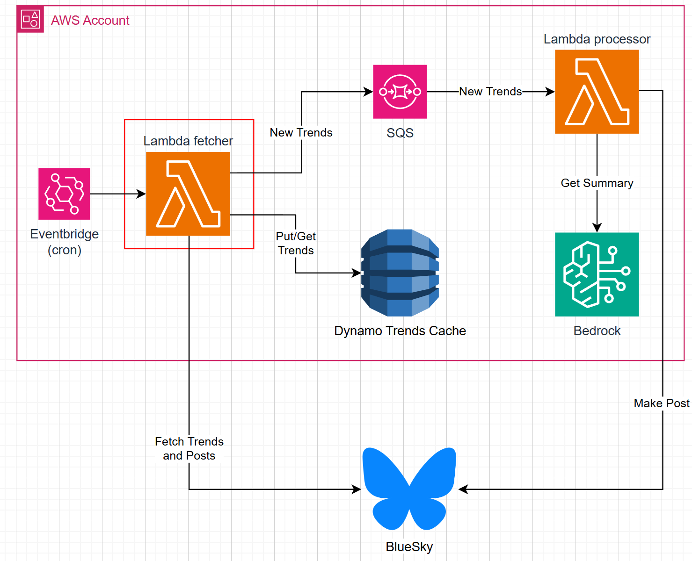

# Out of the Loop - Fetcher

Application responsible for fetching the latest trends and posts from Bluesky.

This lambda:
- Fetches the current trends
- Fetches posts from the current trends
- Checks if the posts are already in the cache (DynamoDB)
- If not, it stores the posts in the cache (DynamoDB)
- Sends the posts to the SQS queue for further processing by the Lambda Processor

### Solution overview

This lambda is highlighted in red.

[Lambda Processor](https://github.com/carloscamposiki/outl-ai-fetcher).
### Environment Variables
- `SESSION_SECRET_NAME`: The name of the AWS Secrets Manager secret that contains the Bluesky session token. This secret allows the lambda to reuse the session token for fetching posts without needing to log in again for each execution.
- `BLUE_SKY_CREDENTIALS_SECRET_NAME`: The name of the AWS Secrets Manager secret that contains the Bluesky credentials (username and password). This is used to log in to Bluesky if the session token is not available.
- `TRENDS_PROCESSING_QUEUE`: The URL of the SQS queue where the fetched posts will be sent for further processing.
- `DYNAMO_TRENDS_TABLE_NAME`: The name of the DynamoDB table where the fetched trends will be cached.

### Technologies

- `AWS Lambda`: Function to run the code in a serverless environment.
- `AWS Secrets Manager`: To securely store and retrieve the Bluesky session token and credentials.
- `AWS SQS`: To send the fetched posts for further processing.
- `AWS DynamoDB`: To cache the fetched trends.
- `Bluesky API`: To fetch the latest trends and posts.
- `Python 3:11`: The programming language used for the Lambda function.
- `Boto3`: The AWS SDK for Python, used to interact with AWS services like SQS, DynamoDB, and Secrets Manager.
- `Github Actions`: For CI/CD to build and deploy the Lambda function.

### Folder structure
- `.github/workflows`: Contains the GitHub Actions workflow files for CI/CD.
- `doc`: Contains documentation files.
- `app`: Contains the source code for the Lambda function.
- `infra`: Contains the infrastructure as code files for deploying the Lambda function 
